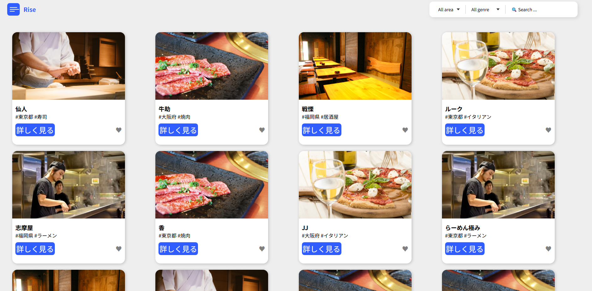
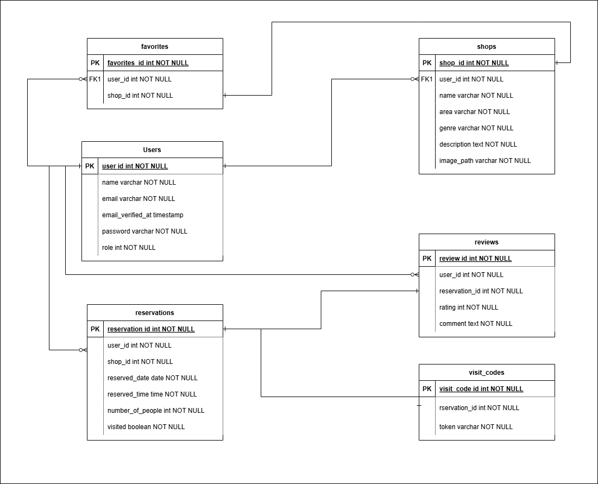

# Rese

飲食店予約サービス
**概要説明（どんなアプリか）**
本アプリケーションは、飲食店予約サービスです。
ユーザーは飲食店の一覧や詳細を確認し、日時と人数を指定して予約できます。
また、管理ユーザーは予約された内容の閲覧やショップの管理が可能です。

---

## アプリケーション URL
http://localhost

1. 管理者用アカウント
   name: admin
   Email: admin@example.com
   Password: 1qaz2wsx

2. テスト用店長アカウント
   name: テスト用店長
   Email: Manager@example.com
   Password: Password123!

3. テスト用一般ユーザーアカウント
   name: テストユーザー
   Email: user@example.com
   Password: 1qaz2wsx

- テスト用アカウントの内容変更
  src/database/seeders/UserSeeder.php ファイルの内容を適宜編集してください。

---

## 機能一覧

- 会員登録
- ログイン
- ログアウト
- ユーザー情報取得
- ユーザー飲食店お気に入り一覧取得
- ユーザー飲食店予約情報取得
- 飲食店一覧取得
- 飲食店詳細取得
- 飲食店お気に入り追加
- 飲食店お気に入り削除
- 飲食店予約情報追加
- 飲食店予約情報削除
- エリアで検索する
- ジャンルで検索する
- 店名で検索する
- パスワード変更画面表示
- パスワード変更処理
- メール認証画面（ビュー）
- メール認証完了処理
- 認証リンク再送信
- 会員登録完了後のサンクス画面
- 予約内容変更処理
- ユーザーマイページ表示
- QR コード表示
- 未レビュー一覧表示
- レビュー作成フォーム表示
- レビュー投稿処理
- 店舗管理ダッシュボード
- 店舗情報登録処理
- 店舗情報編集処理
- お知らせメール作成画面表示
- お知らせメール確認画面表示
- お知らせメール送信処理
- QR 確認（訪問確認）処理
- 来店済みフラグ付与処理
- 店長アカウント登録画面表示
- 店長アカウント登録処理
- 予約キャンセル処理

---

## 使用技術（実行環境）

- PHP 7.4.9
- Laravel 8.83.29
- MySQL 8.0.26
- JavaScript 18.20.6
- Docker 27.3.1

---

## ER 図

---

## 環境構築

**Docker ビルド**

1. git clone git@github.com:snowrain-lazuli/work-time.git
2. DockerDesktop アプリを立ち上げる
3. docker-compose up -d --build

> _Mac の M1・M2 チップの PC の場合、no matching manifest for linux/arm64/v8 in the manifest list entries のメッセージが表示されビルドができないことがあります。
> エラーが発生する場合は、docker-compose.yml ファイルの「mysql」内に「platform」の項目を追加で記載してください_
> bash
> mysql:

    platform: linux/x86_64(この文追加)
    image: mysql:8.0.26
    environment:

**Laravel 環境構築**

1. docker-compose exec php bash
2. composer install
3. 「.env.example」ファイルを 「.env」ファイルに命名を変更。または、新しく.env ファイルを作成
4. .env に以下の環境変数を追加
   text
   DB_CONNECTION=mysql
   DB_HOST=mysql
   DB_PORT=3306
   DB_DATABASE=laravel_db
   DB_USERNAME=laravel_user
   DB_PASSWORD=laravel_pass

5. アプリケーションキーの作成
   bash
   php artisan key:generate

6. マイグレーションの実行
   bash
   php artisan migrate

7. シーディングの実行
   bash
   php artisan db:seed
